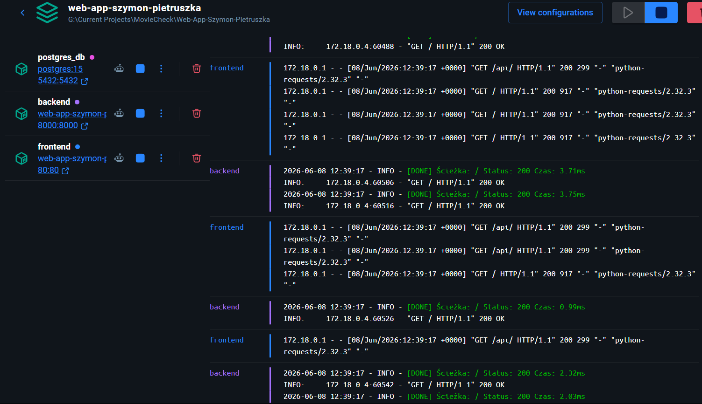
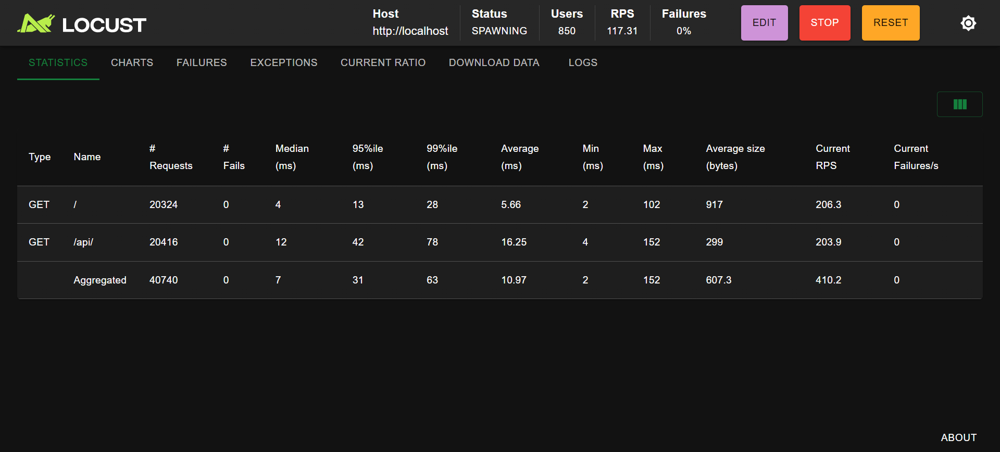

# Monitoring Aplikacji

Aplikacja MovieCheck wykorzystuje dwupoziomowy system monitorowania stanu i diagnozy błędów, oparty na logach systemowych oraz zewnętrznej platformie Sentry.

## Logi Kontenerów
Głównym narzędziem diagnostycznym są zagregowane logi systemowe zbierane bezpośrednio z kontenerów Docker.

**Podgląd logów w czasie rzeczywistym:**

```bash
docker compose logs -f
```

# Sentry
### Monitorowanie Awarii w Kodzie
W projekcie MovieCheck platforma ta służy do natychmiastowego przechwytywania awarii kodu, takich jak błędy połączenia z bazą danych, niepoprawne haszowanie czy błędy w operacjach na danych. **Sentry** automatycznie agreguje usterki i wskazuje dokładną linię kodu, która spowodowała crash aplikacji.

### Konfiguracja
Aby monitorować aplikacje trzeba dodać klucz z oficjalnej strony [Sentry](https://sentry.io/welcome/). Zaloguj się i stwórz nowy projekt. Następnie wybierz platformę **(Python/FastAPI)** i skopiuj klucz `DSN` wklejając go do pliku `.env`.

```python
DSN_KEY="KLUCZ"
```

## Logi i Monitorowanie
Zaimplementowano dedykowany moduł `logging` połączony z funkcją Middleware w FastAPI. Każde żądanie HTTP mierzy czas przetwarzania od momentu odebrania zapytania do odesłania odpowiedzi.

### Struktury Logów

#### Żądania Zakończone Sukcesem
Każde poprawne przetworzenie żądania przez serwer generuje zielony wpis informacyjny.

```text
[DONE] Ścieżka: <PATH> Status: <STATUS_CODE> Czas: <EXECUTION_TIME>ms
```

#### Żądania Zakończone Błędem

W momencie wystąpienia nieobsługiwanego wyjątku w kodzie, Middleware przechwytuje zdarzenie, mierzy czas do momentu awarii i zrzuca do konsoli czerwony wpis zawierający pełen kontekst błędu.

```text
[Error] Metoda: <METHOD> Ścieżka: <PATH> Rodzaj: <EXCEPTION_TYPE> Komunikat: <MESSAGE> Czas: <EXECUTION_TIME>ms
```



# Locust
### Testy Stabilności pod Obciążeniem
Do weryfikacji stabilności środowiska kontenerowego w warunkach wzmożonego ruchu wykorzystano narzędzie **Locust**

Narzędzie te symuluje ruch n użytkowników generujących zapytania w ustawionych interwałach do endpointów `backendu` oraz `frontendu`

