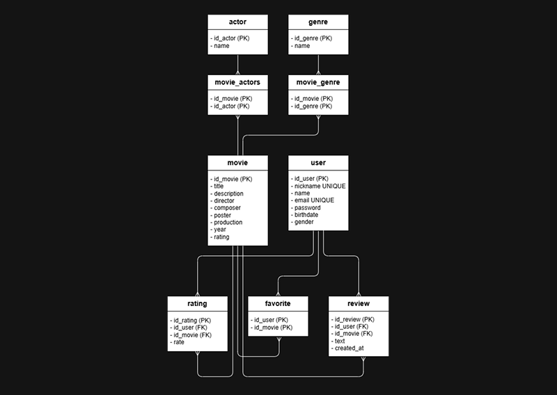
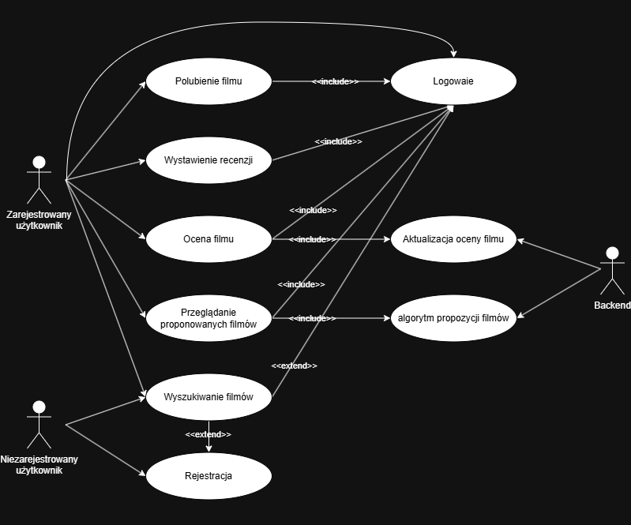

Projekt ma na celu pomóc użytkownikowi w wyborze filmu do obejrzenia. Aplikacja będzie umożliwiała przeglądanie listy filmów, wyszukiwanie ich oraz zapisywanie wybranych tytułów do listy ulubionych. Można wystawiać i przeglądać recenzje oraz oddawać ocene (od 1 do 10) na wybrany film, ale tylko raz bez edycji późniejszej.

Projekt został w pełni **skonteneryzowany za pomocą Dockera**. Cały kod, biblioteki oraz konfiguracja środowiska zostały zamknięte wewnątrz niezależnego kontenera.

Izolacja środowiska gwarantuje stabilność, bezpieczeństwo i błyskawiczne uruchomienie bez konieczności ręcznej instalacji baz danych czy dodatkowych pakietów.

## **Aplikacja webowa bez Dockera**

Instalacja oraz kod źródłowy aplikacji webowej w wersji bez wsparcia dla środowiska Docker zostały wydzielone na osobną gałąź [**web-app**](https://github.com/TAW-26/Web-App-Szymon-Pietruszka/tree/web-app)


## Instrukcja uruchomienia

Aby uruchomić aplikację na swoim komputerze, upewnij się, że masz zainstalowany program [**Docker Desktop**](https://docs.docker.com/desktop/). Jeżeli pracujesz na windows to pobierz jeszcze `WSL` za pomocą komendy:

```bash
wsl --install
```

Po pobraniu projektu wpisz do terminala w głównym folderze projektu w głównym folderze projektu (tam, gdzie znajduje się plik `Dockerfile` lub `docker-compose.yml`)

```bash
docker compose up --build
```

Po zakończeniu procesu aplikacja będzie dostępna w przeglądarce internetowe na `http://localhost`

## Diagram ERD
Przedstawia strukturę bazy danych aplikacji. System przechowuje informacje o filmach, użytkownikach, aktorach, gatunkach, ocenach, recenzjach, polubionych filmach oraz relacjach między nimi.



## Diagram Przypadków Użycia

Przedstawia funkcje dostępne dla użytkowników zalogowanych i niezalogowanych. Użytkownik niezalogowany może się rejestrować i przeglądać filmy, natomiast zalogowany korzysta z pełnych funkcji systemu, takich jak ocenianie, recenzowanie, polubienie filmu oraz przeglądanie proponowanych dla użytkownika filmów. Backend odpowiada za wykonywanie algorytmów oraz automatyczne aktualizowanie ocen filmów.




## Dokumentacja
Szczegółowe informacje dotyczące aplikacji:
- [temat aplikacji webowej](./Doc/TOPIC.md)
- [dokumentacji projektu](./Doc/TOPIC.md)
- [monitorowanie aplikacji](./Doc/MONITORING.md)
- [opis API](./Doc/API.md)
- [opis UI](./Doc/UI.md)
