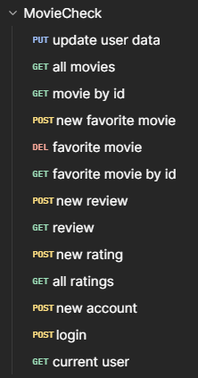

# Dokumentacja API

Projekt ma na celu pomóc użytkownikowi w wyborze filmu do obejrzenia. Aplikacja będzie wykorzystywać algorytm, który na podstawie preferencji użytkownika będzie proponował filmy dopasowane do jego gustu. System będzie analizował wcześniejsze polubienia użytkownika, aby lepiej dopasować kolejne rekomendacje.

Aplikacja będzie również umożliwiała przeglądanie listy filmów, wyszukiwanie ich oraz zapisywanie wybranych tytułów do listy ulubionych. Zebrane dane o ocenach i polubieniach będą wykorzystywane przez algorytm do rekomendacji filmów.

### Informacje Ogólne
* **Adres bazy:** `http://localhost:8000`
* **Format danych:** `application/json`

---




## Autentykacja i Użytkownicy

### Rejestracja nowego konta
Tworzy profil nowego użytkownika w systemie.
* **Metoda:** `POST`
* **Ścieżka:** `/register`

```json
{
    "nickname": "nick",
    "password": "password",
    "email": "name@email.com"
}
```

### Logowanie

Uwierzytelnia użytkownika i zwracanie tokenu dostępu

* **Metoda:** `POST`
* **Ścieżka:** `/login`

```json
{
    "nickname": "nick",
    "password": "password",
}
```

### Pobieranie profilu zalogowanego użytkownika

Pobiera szczegółowe dane aktualnie zalogowanego użytkownika na podstawie tokenu

* **Metoda:** `GET`
* **Ścieżka:** `/user/me`
* **Autoryzacja:** `Bearer Token`

### Pobierz wszystkich użytkowników

Zwraca listę wszystkich zarejestrowanych użytkowników systemu

* **Metoda:** `GET`
* **Ścieżka:** `/users`

### Aktualizacja danych użytkownika

Modyfikuje informacje powiązane z profilem użytkownika

* **Metoda:** `PUT`
* **Ścieżka:** `/user`

```json
{
    "id_user": 1,
    "gender": "M"
}
```


## Filmy

### Pobierz wszystkie filmy

Pobiera pełną listę filmów dostępnych w bazie danych

* **Metoda:** `GET`
* **Ścieżka:** `/movies`

### Pobierz film po ID

Zwraca szczegółowe informacje o konkretnym filmie

* **Metoda:** `GET`
* **Ścieżka:** `/movie/{id}`
* **Przykład:** `/movie/1`


## Ulubione Filmy

### Dodaj film do ulubionych

Przypisuje wybrany film do listy ulubionych użytkownika

* **Metoda:** `POST`
* **Ścieżka:** `/favorite/{id}`
* **Autoryzacja:** `Bearer Token`


### Usuń film z ulubionych

Usuwa film z listy ulubionych użytkownika

* **Metoda:** `DELETE`
* **Ścieżka:** `/favorite/delete/{movie_id}`
* **Autoryzacja:** `Bearer Token`

### Pobierz ulubione filmy użytkownika

Zwraca listę wszystkich filmów oznaczonych jako ulubione przez konkretnego użytkownika

* **Metoda:** `GET`
* **Ścieżka:** `/favorites/user`
* **Autoryzacja:** `Bearer Token`

## Recenzje i Oceny

### Dodaj nową recenzję

Publikuje tekstową recenzję do wybranego filmu

* **Metoda:** `POST`
* **Ścieżka:** `/review`
* **Autoryzacja:** `Bearer Token`

```json
{
    "id_movie": 1,
    "text": "I like it!",
}
```

### Pobierz recenzje użytkownika

Pobiera listę recenzji napisanych przez konkretnego użytkownika

* **Metoda:** `GET`
* **Ścieżka:** `/user/{user_id}/reviews`
* **Przykład:** `/user/1/reviews`

### Dodaj nową ocenę

Wystawia ocenę numeryczną dla konkretnego filmu

* **Metoda:** `POST`
* **Ścieżka:** `/rating`

```json
{
    "id_user": 1,
    "id_movie": 2,
    "rating": 10
}
```

### Pobierz oceny użytkownika

Zwraca oceny wystawione przez wskazanego użytkownika

* **Metoda:** `GET`
* **Ścieżka:** `/user/{user_id}/ratings`
* **Przykład:** `/user/1/ratings`